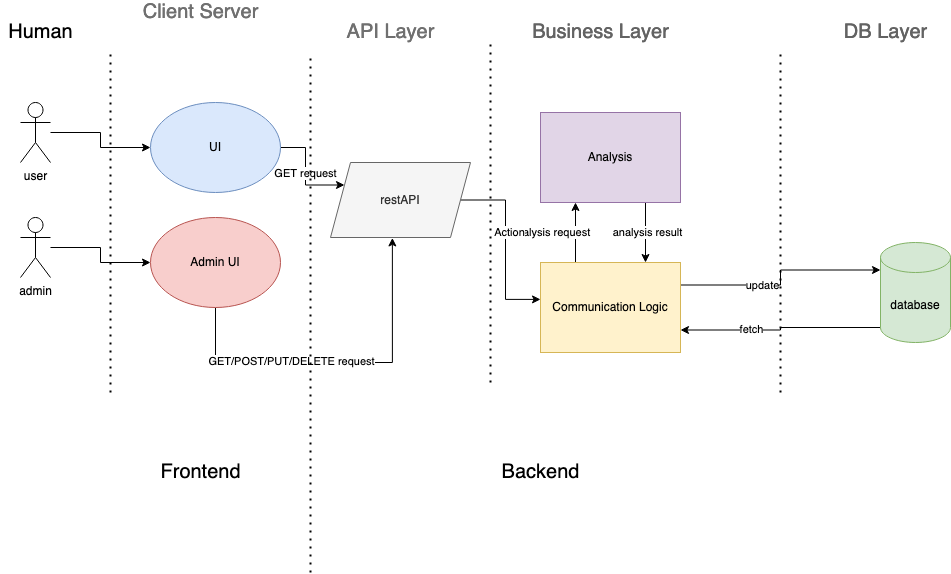

# Interactive Web Visualization Project Proposal
## Members:
* Ben Leone (bleone90@bu.edu)
* Ryuichi Ohhata (ryu74@bu.edu)
* Lukas Rosario (lukasr@bu.edu)
* Jinyu Tian (jinyutn@bu.edu)
* Angela Vellante (akv@bu.edu)
** **

## 1. Vision and Goals Of The Project:
* Provide an intuitive user experience, especially for people outside of BU
* Serve as a base prototype for other departments
* Provide a user interface that allows for easy networking and a clear, concise visualization of connected collaborations
* Provide the ability for researchers to find similar collaborators based on their profiles

## 2. Users/Personas Of The Project
Admins at Hariri will go through an authentication process before being able to access the admin UI. Admins will be able to make additions and deletions if necessary. Regular users will only have the ability to access the information.
* Target:
   * Faculty affiliates of the Hariri Institute for Computing
   * Potential collaborators and researchers looking for assistance in their work
   * BU faculty members and non-members who are conducting teaching/training initiatives in computing or computational science 
   * Anyone interested in how the departments and schools at BU work together and what is done in computing at BU
* Does Not Target:
   * Anyone not interested in the span of multiple computing disciplines and the networking and collaboration done within

## 3. Scope and Features Of The Project:
* Minimum Viable Product:
    * Presents a visually pleasing and easily navigated interface
        * Regular, unauthorized users and admins
            * Implement authentication system
                * Regular users have the ability to see the data on the client server
                * Admins have the authority to make additions, deletions, etc.
        * System of linked nodes representing users collaboration
            * Researchers can find similar collaborators based on their profiles
            * Option to see direct collaboration and extended/mutual links
    * Serve as a base prototype for other departments
        * Showcase the research collaboration at BU
        * Understand the way computing and data-driven research is like at BU
    * Scalability: Can scale to a large number of users
    * Security: Provides secure storage of user credentials, servers, and data

## 4. Solution Concept

Global Architectural Structure Of the Project:
Below is the system components and their descriptions.

* User UI: Visualization of networks with analysis presented to public
* Admin UI: Any admin work will be done in this UI.
* Auth: Authentication is needed for admins to signup/login.
* DB (DB sandbox?): Data and analysis are stored here. 
* Business Logic: All backend jobs such as data analysis will be done here. 
* Communication: This logic is responsible for the communication between frontend and backend.
* GET/POST/PUT/DELETE request to the database via restAPI.

**Figure 1: System components. The frontend consists of the UI and the admin UI, and the backend consists of API, business layer, and database layer.**

Figure 1 is a diagram of the overall software lifecycle for this web-based visualization project. It is expected to have two types of users: regular, unauthorized users and admins. The regular users only have GET request privilege, which fetches the data from database via restAPI and displays it on the client server, whereas admins have GET/POST/PUT/DELETE request privileges if necessary. Authentication system will be implemented, so only the admins with the credential can perform such tasks. All the requests that go to the API layer will be handled by the communication logic in the business layer. The communication logic is responsible for all the communications between restAPI and database, as well as sending commands to Analysis logic to compute any analysis. The communication layer, then, sends the analysis result to the database as well as fetching it to update the data on the restAPI. 

Design Implications and Discussion:
* The layers should not have a significant impact on each other. That being said, if any change that’s been made in one layer should have minimal to no effect to other layers. This is to reduce the time to search for bugs when one part of the program fails. 
* Javascript will be used for the frontend and python will be used for the backend (fact check this).
* The data in restAPI will be fetched from the database per GET request through communication logic. If any changes are made in the database, the updated value will be fetched in the next GET request. 
* Analysis logic computes the jobs only when the database is updated in order to reduce the loading time. The computational functions will be called with POST/PUT/DELETE requests. GET requests will bypass the analysis logic. 

## 5. Acceptance criteria
The minimum acceptance criteria is an interactive, web-based network visualization showing the existing connections between Hariri Institute affiliates.

Stretch goals:
* Analytics implementation for Hariri Institute visualizations
* CLI for deploying similar visualisations in different settings
* Tooling for custom analytics

## 6. Release Planning
* Find user stories and receive feedback from mentors to meet sprint deadlines
* Sprints: 1-2 weeks with code review and merging of code into a weekly release
* Detailed pull request with major changes made to code and any sticking points
* Keep up to date with Taiga project management so that clients are aware of progress/setbacks
