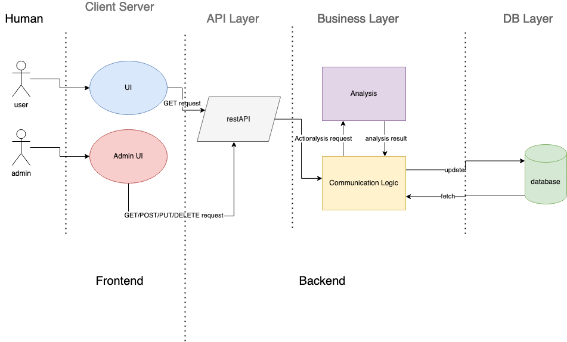

# Interactive Web Visualization of Scientific Collaboration Networks

## Description:

The Hariri Institute for Computing at Boston University is dedicated to leading integrated initiatives in research and technology development, targeting a broad set of disciplines at the nexus of the computational and data sciences. In turn, the Institute also serves as a window for the outside world – viewed, as it were, through a computational lens — into the impact and potential inherent in Boston University’s computational and data-driven investments. The Institute currently has ~250 faculty affiliates. Currently these are represented on the Institute web pages in a simple table format, with some perfunctory search capabilities. As a result, someone from the outside has little ability to glean insight into what is done in computing at BU. Similarly, someone from the inside has little ability to see how people collaborate and what potential there might be for they themselves to join in. This project would develop an interactive, web-based visualization around the scientific collaboration network associated with our faculty affiliates, leveraging data from a bibliographic database(s). It might additionally provide researchers with a tool to find other similar collaborators based on their research profiles. Fundamentally, it would change the way computing and data-driven research at BU can be understood and likely would serve as a prototype for adoption more broadly in understanding and showcasing research collaboration at BU in general.

| Members                       | Project Mentors                                                                      |
| ----------------------------- | ------------------------------------------------------------------------------------ |
| Ben Leone (bleone90@bu.edu)   | Eric Kolaczyk - Hariri Institute, Director (kolaczyk@bu.edu)                         |
| Ryuichi Ohhata (ryu74@bu.edu) | Arezoo Sadeghi - SAIL (asadeg02@bu.edu)                                              |
| Lukas Rosario (lukasr@bu.edu) | Margot Menestrot - Red Hat UX team (mmenestr@redhat.com)                             |
| Jinyu Tian (jinyutn@bu.edu)   | Joe Farmer - BU Office of Research, Program Manager & Data Analyst (jpfarmer@bu.edu) |
| Angela Vellante (akv@bu.edu)  | Jonathan Chamberlin - EC 528: AU20 Teaching Fellow (jdchambo@bu.edu)                 |

---

## 1. Vision and Goals Of The Project:

This project focuses on the development of an interactive, web-based visualization around the scientific collaboration network associated with the Hariri Institute faculty affiliates, leveraging the data from a bibliographic database, specifically SciVal. The data includes a varity of connections between the authors of academic works and those who have collaborated on the works. Currently, there is not a way for visitors to the affiliates page to determine any collaboration with researchers in the Institute. With this visualization and the data from SciVal, the overall vision and goals of this project include:

- Create a cleaner view of the affiliates than the current spreadsheet design which uses only raw HTML code
- Provide an intuitive user experience that allows for easier navigation of the connections between collaborators using a network visualization
- Provide researchers with tools to find similar collaborators based on fields of interest, past work and articles, etc.
- May serve as a base prototype for other departments to implement a visualization of academic collaboration

## 2. Users/Personas Of The Project:

A user of the network visualization maybe a researcher either within or outside of Boston University. The have recently begun work on an academic paper that is relevent to the work performed at the Hariri institute and found an author who is an affiliate. By searching for this affiliate within the network visualization, they will be able to find other researchers based on co-authored work or similar fields of interest.

Targets of the network visualization include:

- Faculty affiliates of the Hariri Institute for Computing
- Potential collaborators and researchers looking for assistance in their work
- BU faculty members and non-members who are conducting teaching/training initiatives in computing or computational science
- Anyone interested in how the BU departments and colleges work together and what work is done in the fields of computing and computational science

## 3. Scope and Features Of The Project:

Minimum Viable Product (MVP):

As stated by the description and our inital goals of the project, the MVP includes:

- A clean and intuitive visualization of the collaboration network between affiliates within the Hariri Institute

  - Nodes in the visualization are the affiliates
  - Edges that connect the nodes are primarily the number of collborations
  - A search/filter function to allow more granularity
  - The network visualization will be dynamic (i.e. clicking on a node displays its connections clearly to the user)
  - Links to academic works will be included, when possible

- The size of the network will be ~250 affiliates

  - Not all affilates will be presented at the initial landing on the visualization
  - Possible breadown by department to then show affiliates within selected department

- Admin accessability
  - With consultation from mentors, the database will be updated yearly with the collaborations from SciVal
  - Once new data is entered, the pipeline of DB -> API -> Front-end visualization will be seemless and pass the "monkey-test"
  - Data will be secured within a database accessable to BU admins

## 4. Solution Concept

Global Architectural Structure Of the Project:

- User UI: Visualization of networks with analysis presented to public
- Admin UI: Any admin work will be done in this UI.
- Auth: Authentication is needed for admins to signup/login.
- Database: Data of affiliates and their research are stored here.
- Business Logic: All backend jobs such as data analysis will be done here.
- Communication: This logic is responsible for the communication between frontend and backend.
  - GET/POST/PUT/DELETE request to the database via restAPI.

**Figure 1: System components. The frontend consists of the UI and the admin UI, and the backend consists of API, business layer, and database layer.**

Figure 1 is a diagram of the overall software lifecycle for this web-based visualization project. It is expected to have two types of users: regular, unauthorized users and admins. The regular users only have GET request privilege, which fetches the data from database via restAPI and displays it on the client side, whereas admins have GET/POST/PUT/DELETE request privileges if necessary. Authentication system will be implemented, so only the admins with the credential can perform such tasks. All the requests that go to the API layer will be handled by the communication logic in the business layer. The communication logic is responsible for all the communications between restAPI and database, as well as sending commands to Analysis logic to compute any analysis. The communication layer, then, sends the analysis result to the database as well as fetching it to update the data on the restAPI.

Design Implications and Discussion:

- The layers should not have a significant impact on each other. That being said, if any change that’s been made in one layer should have minimal to no effect to other layers. This is to reduce the time to search for bugs when one part of the program fails.
- Vanilla Javascript or a JS framework (i.e. React.js) will be used for the frontend and Python and Flask will be used for the backend.
- The data in restAPI will be fetched from the database per GET request through communication logic. If any changes are made in the database, the updated value will be fetched in the next GET request.
- Analysis logic computes the jobs only when the database is updated in order to reduce the loading time. The computational functions will be called with POST/PUT/DELETE requests. GET requests will bypass the analysis logic.

## 5. Acceptance criteria

The minimum acceptance criteria is an interactive, web-based network visualization showing the existing connections between Hariri Institute affiliates and their research areas.

Stretch goals:

- Analytics implementation for Hariri Institute visualizations
- CLI for deploying similar visualizations in different settings
- Tooling for custom analytics

## 6. Release Planning

- Sprint 1 (Demo: Oct. 1):

  - As an admin user, I’d like to be able to easily see who’s involved and how they are related to each other
    - Visualization of network collaborations
  - As a potential collaborator, I’d like to interact with the visualization in order to make it easier to get in contact with a researcher within the Institute
  - As a BU faculty member, I’d like for my contact information to be displayed if a potential collaborator were interested in working with me
  - configure API
  - Start constructing D3 front-end
  - Discuss with mentors what kind of database to use
  - Keep up to date with Taiga project management so that clients are aware of progress/setbacks

  _Demo 1 - API call working to static DB; D3.js demo of team network_

- Sprint 2 (Demo: Oct. 15)：

  - As a regular user, I would like for my contact and collaboration information to be updated frequently, so I don’t miss out on opportunities
  - As a user of this network i would like to privately collab with someone in the department of biomedical engineering and maybe someone else within the domain of biostatistics and public health because i need a team for research
  - As someone not currently affiliated with computing at BU, I would like to see what work is currently being done so that I can reach out if there are projects that align with my interests and experience
    - Filter: department, college, domains, interests
  - Combine D3 front-end with current API
  - Keep up to date with Taiga project management so that clients are aware of progress/setbacks

- Sprint 3 (Demo: Oct. 29):

  - TBD
  - Keep up to date with Taiga project management so that clients are aware of progress/setbacks

- Sprint 4 (Demo: Nov. 12):

  - TBD
  - Keep up to date with Taiga project management so that clients are aware of progress/setbacks

- Sprint 5 (Demo: Dec. 3):
  - Make sure our project's goals and requirements are fulfilled
  - Verify all features are implemented correctly and working smoothly
  - Keep up to date with Taiga project management so that clients are aware of progress/setbacks
